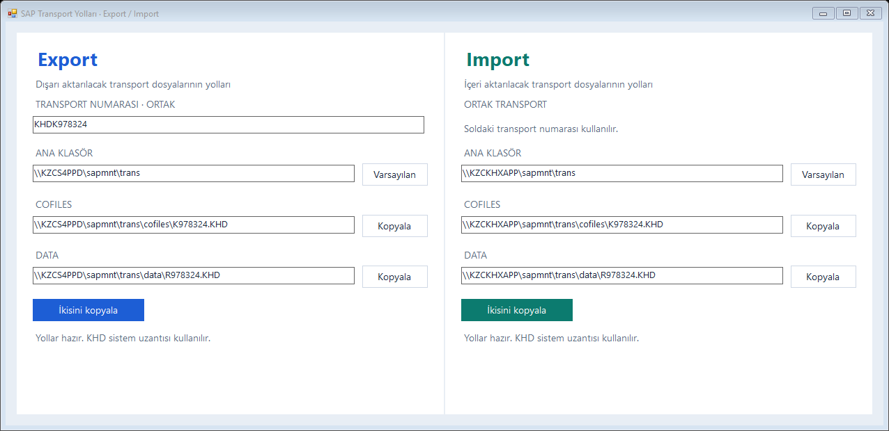

# SAP Transport Yolları

SAP transport numarasından Export ve Import dosya yolları oluşturan küçük bir Windows uygulaması.



## Çalıştırma

[SAP-Transport-Yollari.exe](SAP-Transport-Yollari.exe) dosyasını indirin ve çift tıklayın. Kurulum gerekmez. Windows ve .NET Framework 4.x gerekir.

## Kullanım

1. Soldaki ortak transport alanına `KHDK978324`, `K978324` veya `978324` yazın.
2. Gerekirse Export ve Import ana klasörlerini bağımsız olarak değiştirin.
3. Oluşan yolları yanlarındaki **Kopyala** düğmeleriyle kopyalayın. **İkisini kopyala**, bulunduğu bölümün iki yolunu ayrı satırlar halinde kopyalar.

Varsayılan Export ana klasörü: `\\KZCS4PPD\sapmnt\trans`

Varsayılan Import ana klasörü: `\\KZCKHXAPP\sapmnt\trans`

Örnek Export çıktıları:

```text
\\KZCS4PPD\sapmnt\trans\cofiles\K978324.KHD
\\KZCS4PPD\sapmnt\trans\data\R978324.KHD
```

Örnek Import çıktıları:

```text
\\KZCKHXAPP\sapmnt\trans\cofiles\K978324.KHD
\\KZCKHXAPP\sapmnt\trans\data\R978324.KHD
```

Transport numarası tam 6 rakamdır; baştaki sıfırlar korunur. Küçük harfler ve girdiyi çevreleyen eşleşen tırnaklar kabul edilir. `.KHD` uzantısı iki tarafta da sabittir.

**Varsayılan** düğmeleri ilgili bölümün başlangıç yolunu geri getirir. Klasör değişiklikleri uygulama kapatıldığında saklanmaz. Uygulama yalnızca yol metinleri üretir; ağdaki dosyalara erişmez veya dosya aktarımı yapmaz.

## Kaynaktan derleme

Windows PowerShell ile proje klasöründe çalıştırın:

```powershell
powershell -ExecutionPolicy Bypass -File .\kaynak\derle.ps1
```

Betik, Windows üzerindeki .NET Framework C# derleyicisini kullanır ve kök klasördeki `SAP-Transport-Yollari.exe` dosyasını oluşturur. Ek NuGet paketi gerekmez.

## Kontroller

```powershell
powershell -ExecutionPolicy Bypass -File .\tests\kontrol.ps1
```

43 kontrol; giriş biçimlerini, geçersiz girdileri, ortak transport güncellemesini, bağımsız klasörleri ve varsayılanlara dönüşü doğrular. Test sırasında pencere ekran dışında açılır; önizleme `work/test-preview.png` olarak kaydedilir.
